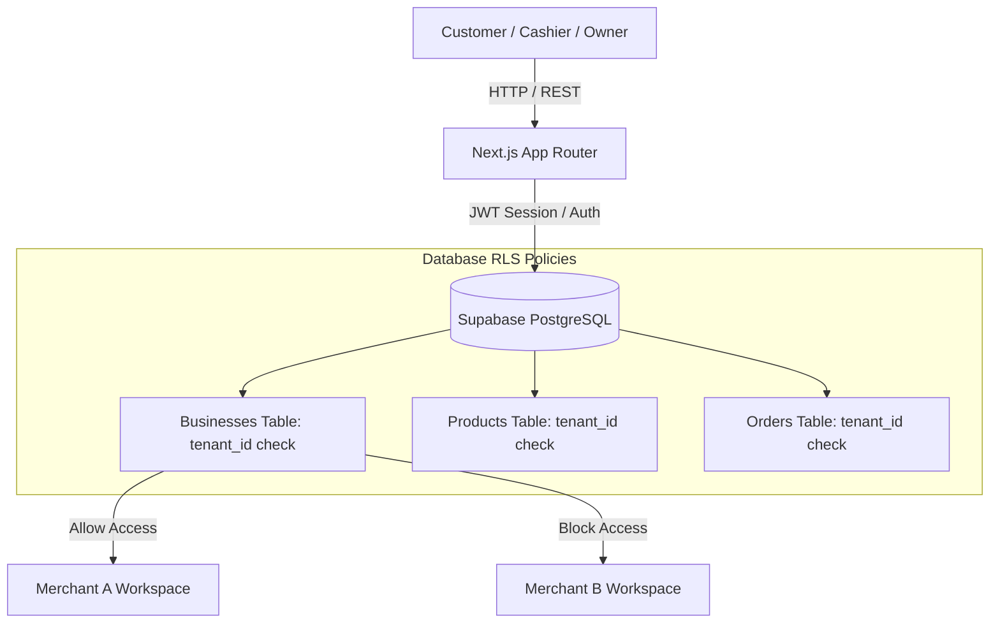
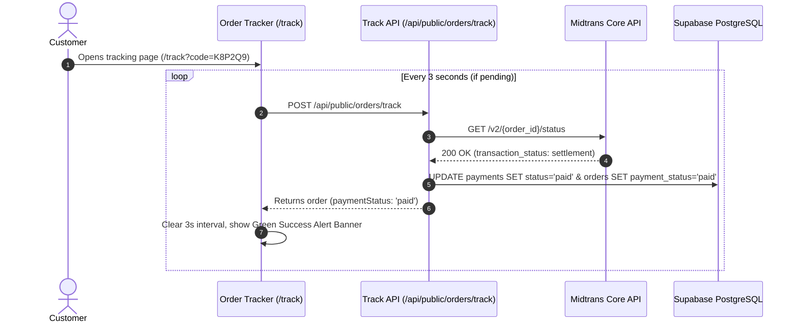

# 🚀 UMKM Pilot

### A Production-Grade Multi-Tenant SaaS Platform with Split-Payment Gateways, Instant Auto-Sync, and LLM-Powered Business Analytics

[](https://nextjs.org/)
[](https://www.typescriptlang.org/)
[](https://supabase.com/)
[](https://midtrans.com/)
[](https://vitest.dev/)
[](https://playwright.dev/)
[](LICENSE)

---

## 📋 Table of Contents

- [📖 Introduction & Overview](#-introduction--overview)
- [✨ Core Application Modules](#-core-application-modules)
- [🛠️ Technology Stack](#️-technology-stack)
- [🏗️ Multi-Tenant Architecture & Payment Flow](#️-multi-tenant-architecture--payment-flow)
- [⚡ Local Development & Setup](#-local-development--setup)
- [🧪 Automated Testing Guide (Vitest + Playwright)](#-automated-testing-guide-vitest--playwright)
- [🗂️ Project Directory Structure](#️-project-directory-structure)
- [🚀 Deployment & Production Checklist](#-deployment--production-checklist)
- [📄 License](#-license)

---

## 📖 Introduction & Overview

**UMKM Pilot** is an end-to-end, multi-tenant SaaS application designed specifically for Micro, Small, and Medium Enterprises (UMKM / MSMEs). The platform streamlines the entire retail and culinary sales pipeline:
1. **Self-Ordering Digital Catalog**: Mobile-first store page accessed via business slug (`/order/[businessSlug]`).
2. **Direct Tenant Payment Gateway**: Payments process directly into the merchant's Midtrans account (QRIS, GoPay, ShopeePay, Virtual Accounts, Credit Cards).
3. **Automated Real-Time Payment Auto-Sync**: Customer order status automatically updates to **Sudah Dibayar** as soon as payment settles—eliminating cashier validation bottlenecks and webhook dependencies.
4. **Real-Time Cashier Console**: Orders stream instantly to cashiers via Supabase Realtime WebSocket channels (`/cashier`).
5. **LLM-Powered Business Analytics**: **Nara AI Pilot** provides merchants with data-driven sales advice, inventory warnings, and automatic promo campaign recommendations.

---

## ✨ Core Application Modules

### 🛒 1. Customer Ordering & Self-Tracking
- **Dynamic Digital Menu**: Instant loading via store slug with category navigation and live product search.
- **Midtrans Payment Integration**: Native Snap payment popup supporting QRIS, Virtual Accounts (BCA, BNI, BRI, Permata, Mandiri, CIMB), E-Wallets, and Credit Cards.
- **3-Second Auto-Polling Status Tracker**: Real-time status tracker (`/order/[businessSlug]/track`) that polls status every 3 seconds for pending payments and automatically stops when settled.
- **Printable Digital Receipts**: Accessible digital receipt view (`/receipt/[orderId]`).

### 🏪 2. Cashier Operations Console
- **Sub-Second Real-Time Queue**: Instant order arrival via Supabase Realtime broadcast channels (`/cashier`).
- **Atomic Order Lifecycle**: Transition order status (`pending` → `paid` → `processing` → `ready` → `completed` / `cancelled`).
- **Automatic Inventory Reconciliation**: Stock is deducted upon checkout and restored automatically if an order is cancelled.

### 📊 3. Merchant Administration Dashboard
- **Business Insights**: Live performance charts, daily revenue metrics, top-selling items, and fulfillment breakdowns (`/admin/insights`).
- **Inventory Control**: Low-stock alerts, stock adjustments, and product catalog management (`/admin/products`, `/admin/stock`).
- **Promo Vouchers**: Merchant-configurable discount codes with redemption limits (`/admin/vouchers`).
- **Nara AI Pilot Assistant**: Contextual AI assistant analyzing real-time store metrics.

### 🏢 4. Platform Owner Portal
- **Tenant Management**: Multi-tenant business metrics, plan statuses, and business toggles (`/platform/businesses`).
- **SaaS Plan Billing**: Automated billing for Starter/Pro tiers (`/platform/subscriptions`).
- **Platform Campaign Coupons**: Global promotional coupons across stores (`/platform/coupons`).
- **System Monitoring**: Live health check monitoring Supabase, Auth, Midtrans, and AI engines (`/platform/monitoring`).

---

## 🛠️ Technology Stack

| Layer | Technology | Purpose |
| :--- | :--- | :--- |
| **Framework** | **Next.js 16.2 (App Router + Turbopack)** | SSR, API routes, and optimized routing |
| **Language** | **TypeScript 5** | End-to-end static typing and compile-time safety |
| **Database** | **PostgreSQL (Supabase)** | Multi-tenant database with Row Level Security (RLS) |
| **Auth & Security** | **Supabase Auth & RLS** | Tenant isolation and session authentication |
| **Realtime** | **Supabase Realtime** | Sub-second order queue WebSockets |
| **Payments** | **Midtrans Snap & Core API** | Tenant-split payments & non-blocking status auto-sync |
| **Unit Testing** | **Vitest + JSDOM** | Fast unit and helper function testing |
| **E2E Testing** | **Playwright** | End-to-end browser user journey testing |
| **AI Engine** | **OpenAI API Standard** | Nara AI Pilot analytical engine |

---

## 🏗️ Multi-Tenant Architecture & Payment Flow

### PostgreSQL Row Level Security (RLS)
Data isolation across tenants is strictly enforced at the database level using `business_id` filters.



### Automatic Payment Synchronization Sequence



---

## ⚡ Local Development & Setup

### Prerequisites
- **Node.js**: v18.x or newer
- **Supabase**: Active Supabase project
- **Midtrans Account**: Sandbox account keys

### 1. Clone & Install Dependencies
```bash
git clone https://github.com/your-username/umkm-pilot.git
cd umkm-pilot
npm install
```

### 2. Configure Environment Variables
Create `.env.local` in the project root:

```env
# Supabase Configuration
NEXT_PUBLIC_SUPABASE_URL=https://your-project-ref.supabase.co
NEXT_PUBLIC_SUPABASE_ANON_KEY=your-client-anon-key
SUPABASE_SERVICE_ROLE_KEY=your-secure-server-service-key

# Developer & Owner Accounts
NEXT_PUBLIC_DEVELOPER_EMAILS=owner@platform.com,developer@platform.com

# LLM Config (OpenAI API Standard compatible)
LLM_API_KEY=your-api-key
LLM_BASE_URL=https://api.openai.com/v1
LLM_MODEL=gpt-4o-mini

# Midtrans Gateway Configuration
NEXT_PUBLIC_MIDTRANS_CLIENT_KEY=SB-Mid-client-your-client-key
MIDTRANS_SERVER_KEY=SB-Mid-server-your-server-key
NEXT_PUBLIC_MIDTRANS_IS_PRODUCTION=false
MIDTRANS_SNAP_BASE_URL=https://app.sandbox.midtrans.com
MIDTRANS_CORE_API_BASE_URL=https://api.sandbox.midtrans.com
```

### 3. Run Development Server
```bash
npm run dev
```
Open [http://localhost:3000](http://localhost:3000) in your browser.

---

## 🧪 Automated Testing Guide (Vitest + Playwright)

The project includes unit, integration, and end-to-end test suites.

### 1. Unit & Integration Testing (Vitest)
Vitest executes tests for currency formatting, status mapping, and payment type conversions.

```bash
# Run unit tests once
npm run test

# Run unit tests in watch mode
npm run test:watch
```

### 2. End-to-End Testing (Playwright)
Playwright tests complete customer user journeys (catalog navigation, invalid code validation, cashier views).

```bash
# Install Playwright browser binaries (first-time setup)
npx playwright install

# Run E2E tests in headless mode
npm run test:e2e
```

---

## 🗂️ Project Directory Structure

```text
UMKM-Web/
├── docs/                       # Architecture guides & checklists
├── public/                     # Brand logos and static icons
├── supabase/
│   ├── migrations/             # SQL migrations in chronological order
│   └── reset_database.sql      # Test workspace reset script
├── tests/
│   ├── e2e/                    # Playwright E2E browser tests
│   │   └── order-flow.spec.ts
│   └── unit/                   # Vitest unit test suites
│       ├── format.test.ts
│       └── paymentHelpers.test.ts
├── src/
│   ├── app/                    # Next.js App Router
│   │   ├── admin/              # Merchant management dashboard
│   │   ├── api/                # Secure API endpoints
│   │   ├── cashier/            # Real-time cashier queue console
│   │   ├── login/              # Authentication portal
│   │   ├── order/              # Customer ordering & tracking
│   │   ├── platform/           # Platform Owner SaaS portal
│   │   ├── receipt/            # Digital printable receipt page
│   │   ├── register/           # Multi-step store onboarding
│   │   └── suspended/          # Account suspension screen
│   ├── components/             # Reusable UI components
│   ├── lib/
│   │   ├── data/               # Supabase data access layer
│   │   ├── payments/           # Midtrans client, processors, audit logging
│   │   ├── services/           # Services & broadcast channels
│   │   └── supabase/           # Supabase client configurations
│   ├── services/               # Front-end API wrappers
│   ├── types/                  # Shared TypeScript types
│   └── utils/                  # Currency, status mappers, ETA helpers
├── playwright.config.ts        # Playwright test configuration
├── vitest.config.ts            # Vitest test configuration
└── README.md
```

---

## 🚀 Deployment & Production Checklist

1. **Lint & Build Verification**:
   ```bash
   npm run lint
   npm run build
   ```
2. **Database Realtime Enablement**:
   Ensure PostgreSQL Realtime is enabled in Supabase for tables `orders` and `products`.
3. **Midtrans Webhook URLs**:
   Configure Midtrans Payment Notification URLs:
   - Merchant Webhook: `https://your-domain.com/api/webhooks/midtrans`
   - Subscription Webhook: `https://your-domain.com/api/subscriptions/midtrans/sync`

---

## 📄 License

UMKM Pilot is open-source software licensed under the [MIT License](LICENSE).
