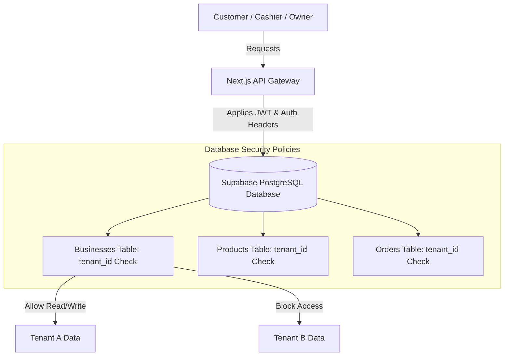

# 🚀 UMKM Pilot

### A Production-Grade Multi-Tenant SaaS Platform with Split-Payment Gateways & LLM-Powered Business Analytics

[](https://nextjs.org/)
[](https://www.typescriptlang.org/)
[](https://supabase.com/)
[](https://midtrans.com/)
[](LICENSE)

---

## 📖 Introduction

**UMKM Pilot** is a comprehensive, production-ready, multi-tenant SaaS application designed to empower Micro, Small, and Medium Enterprises (UMKM/MSMEs) with state-of-the-art digital tools. The platform streamlines end-to-end business operations—enabling merchants to publish interactive digital catalogs, handle real-time cashier order queues, manage stock levels, calculate dynamic distance-based delivery fees, and receive customer payments directly into their own accounts.

Furthermore, UMKM Pilot features an advanced **LLM-powered Business Coach & Analyst** that delivers contextual sales insights, identifies inventory anomalies, and recommends actionable promotion campaigns.

---

## 📸 Platform Preview

Below are placeholders representing key dashboard screens of the platform:


*Figure 1: Merchant Admin Dashboard showing live analytical charts and LLM-powered sales insights.*


*Figure 2: Mobile-first customer ordering menu featuring dynamic filters and checkout controls.*


*Figure 3: Cashier interface showing real-time incoming orders, fulfillment actions, and stock controls.*

---

## 🛠️ Technology Stack

UMKM Pilot is built on a modern, robust, and highly-scalable stack:

| Layer | Technology | Purpose |
| :--- | :--- | :--- |
| **Framework** | **Next.js 15 (App Router)** | Server-side rendering (SSR), API routes, and optimized routing |
| **Language** | **TypeScript** | Static typing and compile-time code safety |
| **Database** | **PostgreSQL (Supabase)** | Relational database hosting core tenant schemas |
| **Auth & Security** | **Supabase Auth & RLS** | Multi-tenant row separation and role authorization guards |
| **Realtime** | **Supabase Broadcast Channels** | Sub-second order notifications and cashier state synchronization |
| **Styling** | **Vanilla CSS & Tailwind** | Premium UI aesthetics, custom glassmorphic styling, and dark mode |
| **Payments** | **Midtrans Snap & Core API** | Tenant-split payment routing (Platform Subscriptions vs Merchant Sales) |
| **AI / LLM** | **OpenAI API Standard** | Analytical engine and Tanya AI Pilot conversational interface |

---

## 🏗️ Multi-Tenant SaaS Architecture

UMKM Pilot leverages a **shared-database, isolated-schema** architecture enforced through PostgreSQL **Row Level Security (RLS)**.



### Row Level Security (RLS)
Every database transaction is guarded by strict RLS policies. The tenant identifier is parsed directly from the authenticated JWT session or public store slug. This setup prevents cross-tenant data leakage.

### Dynamic Tenant-Split Payments
To support independent merchants, the platform supports a dual-credential payment pipeline:
1. **Platform Level (SaaS Subscriptions)**: Subscriptions to Starter/Pro plans are billed using the **Platform Owner's** Midtrans gateway credentials.
2. **Tenant Level (Merchant Sales)**: Customer orders placed at a specific store are billed using the **Merchant's** own Midtrans Server/Client keys, configured in their business dashboard. Funds flow directly into the merchant's account.

---

## 🤖 AI Capabilities

UMKM Pilot integrates Large Language Models to transform raw transaction data into operational strategy:

*   **Tanya AI Chat Pilot**: A floating, contextual chat assistant trained on the merchant's real-time inventory and sales metrics. It answers operational questions, flags low-stock items, and writes marketing copy on demand.
*   **Analytical Widgets**: Automated dashboards that generate summaries of daily sales trends, best-selling product categories, and optimal times for staffing adjustments.
*   **Smart Promo Generator**: Suggests dynamic, stock-aware discount vouchers (e.g., clearance codes for high-stock items) to improve capital turnover.

---

## 🗂️ Project Directory Structure

```text
UMKM-Web/
├── docs/                       # Platform images and architecture documentation
├── public/                     # Static public assets (icons, logos)
├── supabase/
│   └── migrations/             # SQL migrations in chronological order
├── src/
│   ├── app/                    # Next.js App Router folders
│   │   ├── admin/              # Merchant management dashboard modules
│   │   ├── api/                # Secure serverless API endpoints
│   │   ├── cashier/            # Cashier queue management screen
│   │   ├── login/              # Unified authentication portal
│   │   ├── order/              # Customer catalog and tracker interfaces
│   │   ├── platform/           # Platform-owner control dashboard
│   │   ├── register/           # Multi-step business onboarding portal
│   │   └── suspended/          # Subscription alert/block pages
│   ├── components/             # Reusable UI elements (providers, overlays)
│   ├── lib/
│   │   ├── services/           # Data services (profiles, real-time sync)
│   │   ├── supabase/           # Database clients (client, admin, middleware)
│   │   └── subscription/       # Trial calculations and payment webhooks
│   ├── services/               # Front-end API integration helpers
│   ├── types/                  # Shared TypeScript interfaces & types
│   └── utils/                  # Calculations, currency formatters, and helpers
└── run_migration.js            # Node script for database setup
```

---

## ⚡ Installation & Local Development

Follow these steps to set up a local development environment:

### Prerequisites
- Node.js (v18.x or newer)
- A Supabase Project
- A Midtrans Sandbox Account

### 1. Clone the Repository & Install Dependencies
```bash
git clone https://github.com/your-username/umkm-pilot.git
cd umkm-pilot
npm install
```

### 2. Configure Environment Variables
Create a `.env.local` file in the root directory. Use the template below:

```env
# Supabase Configuration
NEXT_PUBLIC_SUPABASE_URL=https://your-project-ref.supabase.co
NEXT_PUBLIC_SUPABASE_ANON_KEY=your-client-anon-key
SUPABASE_SERVICE_ROLE_KEY=your-secure-server-service-key

# Developer & Owner Accounts
NEXT_PUBLIC_DEVELOPER_EMAILS=owner@platform.com,developer@platform.com

# LLM Config (OpenAI API Standard compatible)
LLM_API_KEY=your-api-key
LLM_BASE_URL=https://api.openai.com/v1
LLM_MODEL=gpt-4o-mini

# Midtrans Payment Gateway Configuration
NEXT_PUBLIC_MIDTRANS_CLIENT_KEY=SB-Mid-client-your-client-key
MIDTRANS_SERVER_KEY=SB-Mid-server-your-server-key
NEXT_PUBLIC_MIDTRANS_IS_PRODUCTION=false
MIDTRANS_SNAP_BASE_URL=https://app.sandbox.midtrans.com
MIDTRANS_CORE_API_BASE_URL=https://api.sandbox.midtrans.com
```

### 3. Setup Database Schema & Migrations
Apply the SQL files inside `supabase/migrations/` in chronological order:
1. `20260716000001_initial_schema.sql` - Core products, orders, profile, and pricing schema tables.
2. `20260716000002_rls_policies.sql` - Enable RLS security rules on all tenant layers.
3. `20260716000003_seed_data.sql` - Seed starter subscription plans.
4. `20260717000004_business_vouchers.sql` - Create vouchers schemas.
5. `20260717000005_business_vouchers_rls.sql` - Enable RLS vouchers policies.

You can apply these files via your Supabase SQL Editor web console or using the Supabase CLI (`supabase db push`).

> [!NOTE]
> If you need to wipe transactional data and reset the UAT workspace during testing, run the helper SQL script located at [reset_database.sql](file:///d:/Riset/UMKM%20Web/supabase/reset_database.sql) in your Supabase SQL Editor.


### 4. Run the Development Server
```bash
npm run dev
```
Open [http://localhost:3000](http://localhost:3000) in your browser to view the application.

---

## 🚀 Deployment (Vercel + Supabase)

### Deploying the Database (Supabase)
1. Link your local project using the Supabase CLI, or paste the schemas in `supabase/migrations/` directly into the Supabase SQL Web Console.
2. In the **Database API** settings of Supabase, enable the PostgreSQL Realtime channel for tables: `orders` and `products`.

### Deploying the Frontend (Vercel)
1. Import this repository into Vercel.
2. Populate the **Environment Variables** in your Vercel project settings using the keys specified in your `.env.local`.
3. Set the **Build Command** to:
   ```bash
   npm run build
   ```
4. Configure Midtrans Webhooks in your Midtrans Dashboard to point to your deployed production domain:
   - **Merchant Sales Webhook**: `https://your-domain.vercel.app/api/webhooks/midtrans`
   - **SaaS Subscription Webhook**: Configured similarly or using split targets as specified by the platform setup.

---

## 🛣️ Roadmap & Milestones

### Completed Milestones
*   [x] Core Multi-Tenant database schema & Row Level Security (RLS) rules.
*   [x] Mobile-first Customer Ordering interface with dynamic category tabs.
*   [x] Real-time Cashier Queue Dashboard with automatic stock-level reconciliation upon cancellation.
*   [x] Multi-Merchant payment splitting using custom Midtrans API keys.
*   [x] Dynamic Delivery Fee structures with configurable rounding behaviors (Ceil, Floor, Round).
*   [x] Contextual LLM-powered Tanya AI chatbot and automated analytical insights.
*   [x] Dynamic "Blank" image placeholders for cleaner UI catalog presentation.

### Upcoming Roadmap
*   [ ] Multi-outlet/branch support for enterprise-scale tenants.
*   [ ] Offline cashier queue synchronizer for weak connection situations.
*   [ ] Native iOS & Android companion applications for instant order push alerts.

---

## 🤝 Contribution Guidelines

We welcome contributions from the open-source community! To contribute:

1. **Fork** the repository on GitHub.
2. Create a new feature branch:
   ```bash
   git checkout -b feature/amazing-feature
   ```
3. Ensure your code passes TypeScript type checks and lint checks:
   ```bash
   npm run lint
   node node_modules/typescript/bin/tsc --noEmit
   ```
4. Commit your changes following conventional commit standards.
5. Push to the branch and open a **Pull Request**.

---

## 📄 License

UMKM Pilot is open-source software licensed under the [MIT License](LICENSE).
