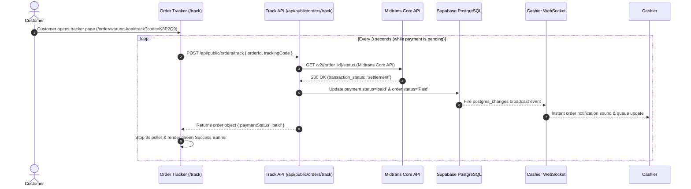

# 🚀 UMKM Pilot

### A Production-Grade Multi-Tenant SaaS Platform for Micro, Small, and Medium Enterprises (UMKM)
#### Split-Payment Gateways, Instant Auto-Sync, Real-Time Cashier Console, and LLM-Powered Business Analytics

[](https://nextjs.org/)
[](https://www.typescriptlang.org/)
[](https://supabase.com/)
[](https://midtrans.com/)
[](https://vitest.dev/)
[](https://playwright.dev/)
[](LICENSE)

---

## 📋 Table of Contents

1. [📖 Product Overview & Architecture](#-product-overview--architecture)
2. [🗺️ End-to-End User Journeys & Feature Modules](#️-end-to-end-user-journeys--feature-modules)
   - [🛒 1. Public Customer Self-Ordering Portal](#-1-public-customer-self-ordering-portal)
   - [🔔 2. Real-Time Order Tracking & Payment Auto-Sync](#-2-real-time-order-tracking--payment-auto-sync)
   - [👨‍🍳 3. Real-Time Cashier Operations Console](#-3-real-time-cashier-operations-console)
   - [📊 4. Merchant Admin Management Dashboard](#-4-merchant-admin-management-dashboard)
   - [👑 5. Platform Owner SaaS Management Portal](#-5-platform-owner-saas-management-portal)
3. [📐 Database Schema & Multi-Tenant Security (RLS)](#-database-schema--multi-tenant-security-rls)
4. [🔄 Sequence Diagrams & Data Flows](#-sequence-diagrams--data-flows)
   - [Payment Auto-Synchronization Flow](#payment-auto-synchronization-flow)
   - [Multi-Tenant Data Access Architecture](#multi-tenant-data-access-architecture)
5. [🛠️ Technology Stack & Library Ecosystem](#️-technology-stack--library-ecosystem)
6. [⚡ Local Development & Setup Guide](#-local-development--setup-guide)
7. [🧪 Testing & Quality Assurance (Vitest + Playwright)](#-testing--quality-assurance-vitest--playwright)
8. [📁 Comprehensive Directory Structure](#-comprehensive-directory-structure)
9. [🚀 Production Deployment Checklist](#-production-deployment-checklist)
10. [📄 License](#-license)

---

## 📖 Product Overview & Architecture

**UMKM Pilot** is a modern, full-stack, multi-tenant SaaS web application built to empower Indonesian Micro, Small, and Medium Enterprises (UMKM / MSMEs). The application eliminates traditional point-of-sale hardware dependencies, manual bank transfer confirmations, and fragmented management tools by providing an all-in-one digital ecosystem.

### Core Value Propositions:
- **Instant Digital Storefront**: Each merchant receives a dedicated public ordering page accessible via unique slug (`/order/[businessSlug]`).
- **Direct Merchant Payment Integration**: Payments process directly into the merchant's Midtrans Payment Gateway account via QRIS, E-Wallets (GoPay, ShopeePay), Virtual Accounts, or Cash.
- **Non-Blocking Payment Auto-Sync**: Orders automatically update to **Paid (Lunas)** within 3 seconds of payment settlement—bypassing webhook bottlenecks.
- **Sub-Second Cashier WebSockets**: Orders stream directly to the cashier kitchen console (`/cashier`) via Supabase Realtime channels with audio-visual notifications.
- **Nara AI Pilot Assistant**: Embedded AI analytics engine providing data-driven sales insights, inventory warnings, and automatic promo recommendations.
- **Dynamic Plan Management**: Fully customizable subscription plans with dynamic feature toggles and limit configurations managed directly by the Platform Owner.

---

## 🗺️ End-to-End User Journeys & Feature Modules

```
                    ┌─────────────────────────────────────────────────────────┐
                    │                    UMKM PILOT ECOSYSTEM                 │
                    └─────────────────────────────────────────────────────────┘
                                                 │
      ┌────────────────────────┬─────────────────┴───────────────┬────────────────────────┐
      ▼                        ▼                                 ▼                        ▼
┌───────────┐            ┌───────────┐                     ┌───────────┐            ┌───────────┐
│ Customer  │            │  Cashier  │                     │ Merchant  │            │ Platform  │
│ Portal    │            │  Console  │                     │ Admin     │            │ Owner     │
└───────────┘            └───────────┘                     └───────────┘            └───────────┘
```

### 🛒 1. Public Customer Self-Ordering Portal
- **Location**: `/order/[businessSlug]`
- **Key Features**:
  - **Dynamic Product Catalog**: Real-time menu list grouped by categories (Food, Drinks, Snacks, Packages) with instant search filtering.
  - **Fulfillment Types**: Choice between **Takeaway (Bungkus)**, **Dine-In (Makan di Tempat)**, and **Delivery (Pengiriman)**.
  - **Dynamic Delivery Calculation**: Supports fixed-rate and distance-based shipping fees (`/km`) with configurable base distance thresholds and rounding modes.
  - **Promo Voucher Validation**: Real-time coupon code redemption supporting fixed Rupiah discounts or percentage markdowns.
  - **Midtrans Payment Gateway**: Native Snap modal integration supporting QRIS, Mandiri/BCA/BNI/BRI/Permata/CIMB Virtual Accounts, GoPay, ShopeePay, Credit Cards, and Cash.
  - **Receipt & Invoice**: Instant digital receipt generation (`/receipt/[orderId]`) printable for physical documentation.

### 🔔 2. Real-Time Order Tracking & Payment Auto-Sync
- **Location**: `/order/[businessSlug]/track`
- **Key Features**:
  - **Order Tracking Code**: Accessible using unique 6-character short tracking codes (e.g. `K8P2Q9`).
  - **3-Second Auto-Sync Poller**: Background polling algorithm querying Midtrans Core API status. As soon as payment completes, the status instantly flips to `Paid` in the database and triggers the cashier screen.
  - **Visual Order Progression**: Timeline steps displaying `Waiting Payment` ➔ `Paid / Queue` ➔ `Processing` ➔ `Ready` ➔ `Completed`.
  - **Store Delivery Note**: Displays custom delivery instructions configured by the merchant.

### 👨‍🍳 3. Real-Time Cashier Operations Console
- **Location**: `/cashier`
- **Key Features**:
  - **Sub-Second Realtime Queue**: Supabase WebSocket channel (`realtimeService`) broadcasting incoming paid and cash orders instantly.
  - **Audio-Visual Order Alerts**: Sound notification chime when new orders arrive.
  - **Atomic Lifecycle Transitions**: Cashiers advance orders through statuses (`Waiting Payment` ➔ `Paid` ➔ `Processing` ➔ `Ready` ➔ `Completed` or `Cancelled`).
  - **Automatic Inventory Reconciliation**: Product stock is automatically deducted upon successful checkout and restored back to inventory if an order is cancelled.
  - **Staff Role Isolation**: Secured cashier logins restricted strictly to store operational management.

### 📊 4. Merchant Admin Management Dashboard
- **Location**: `/admin`
- **Key Features**:
  - **Performance Analytics (`/admin/insights`)**: Live sales charts, revenue metrics, top-performing items, order volume graphs, and **Nara AI Pilot** advisor.
  - **Product & Category Control (`/admin/products`)**: Add, edit, archive products, set pricing, upload images, and assign categories.
  - **Stock Management (`/admin/stock`)**: Low-stock warning badges, stock history, and quick inventory adjustments.
  - **Transactions List (`/admin/transactions`)**: Search, filter, and review historical orders with manual status override.
  - **Reports & Data Export (`/admin/reports`)**: Filter sales by date ranges, order statuses, and payment methods. Export complete spreadsheet data as UTF-8 CSV/Excel.
  - **Promo Voucher Manager (`/admin/vouchers`)**: Create store-specific vouchers with usage caps and minimum transaction thresholds.
  - **Store & Delivery Configuration (`/admin/settings`)**: Configure business profile, tax rates, service charges, delivery parameters, cashier staff accounts, and Midtrans API keys.

### 👑 5. Platform Owner SaaS Management Portal
- **Location**: `/platform`
- **Key Features**:
  - **Business Directory (`/platform/businesses`)**: Complete overview of all registered tenant stores, status management (Active, Trial, Suspended), and direct store profile inspection (`/platform/businesses/[id]`).
  - **Customizable SaaS Plans (`/platform/plans`)**: Create and edit subscription plans. Platform Owners can customize:
    - **Feature Toggles**: Enable/Disable AI Insights (`ai_enabled`), Midtrans Payments (`midtrans_enabled`), and Report Export (`report_export_enabled`).
    - **Limits**: Set Product Limit (`product_limit`), Staff/Cashier Limit (`cashier_limit`), and Monthly Order Limit (`order_limit_monthly`, -1 = Unlimited).
    - **Pricing**: Configure monthly & annual pricing (Annual billing automatically provides 1 month free / 11x monthly price).
  - **Subscription Monitoring (`/platform/subscriptions`)**: Track tenant plan assignments, trial expiry dates, and Midtrans subscription status.
  - **Global Coupons (`/platform/coupons`)**: Create platform-wide promotional discount coupons for SaaS plan subscriptions.
  - **System Health Monitor (`/platform/monitoring`)**: Live status check monitoring Database latency, Auth engine, Midtrans gateway endpoints, and AI models.
  - **SaaS Business Analytics (`/platform/analytics`)**: Monthly Recurring Revenue (MRR), Annual Recurring Revenue (ARR), active tenant count, and plan distribution metrics.

---

## 📐 Database Schema & Multi-Tenant Security (RLS)

Data security and tenant isolation are enforced directly in PostgreSQL via **Supabase Row Level Security (RLS)** using `business_id` scoping.

### Core Database Tables:
- `businesses`: Store profile, slug, settings, payment keys, and active plan reference.
- `profiles`: User profiles linked to `auth.users` with roles (`platform_owner`, `business_owner`, `cashier`) and `business_id`.
- `plans`: SaaS tier specifications (`price_monthly`, `price_annual`, `ai_enabled`, `midtrans_enabled`, `report_export_enabled`, `cashier_limit`, `product_limit`, `order_limit_monthly`).
- `business_subscriptions`: Active store subscriptions, trial dates, and billing status.
- `products`: Product catalog items with prices, stock counts, categories, and image URLs.
- `orders`: Transaction headers storing fulfillment type, customer details, subtotal, shipping fees, tax, service charge, and status.
- `order_items`: Order line item details snapshotting product name and price at checkout time.
- `payments`: Midtrans payment transactions, transaction IDs, payment methods, and settlement timestamps.
- `vouchers`: Store promotional discount codes.
- `coupons`: Global SaaS plan subscription promotional codes.
- `midtrans_transactions_log`: Audit logs for all Midtrans status synchronization events.

---

## 🔄 Sequence Diagrams & Data Flows

### Payment Auto-Synchronization Flow



### Multi-Tenant Data Access Architecture

```mermaid
graph TD
    User[Client Request: JWT Token] --> Gateway[Next.js App Router API / RLS Engine]
    
    subgraph PostgreSQL Row Level Security (RLS)
        Gateway --> AuthCheck{Check auth.uid()}
        AuthCheck -->|Extract business_id| RLSFilter[Apply RLS Policy: WHERE business_id = user_business_id]
    end

    RLSFilter -->|Tenant A| DataA[(Merchant A Data Isolated)]
    RLSFilter -->|Tenant B| DataB[(Merchant B Data Isolated)]
```

---

## 🛠️ Technology Stack & Library Ecosystem

| Component | Technology | Purpose |
| :--- | :--- | :--- |
| **Framework** | **Next.js 16.2 (App Router)** | Full-stack React framework with SSR, Turbopack, and API routes |
| **Language** | **TypeScript 5** | Strict type safety across database models, API handlers, and UI components |
| **Styling** | **Tailwind CSS 3.4** | Utility-first CSS styling with glassmorphism, dark mode, and responsive layouts |
| **Icons** | **Lucide React** | Clean, modern icon library |
| **Database** | **PostgreSQL (Supabase)** | Cloud database with native Row Level Security (RLS) |
| **Auth & Realtime**| **Supabase Auth & Realtime** | JWT authentication, RBAC, and WebSocket broadcast channels |
| **Payment Gateway** | **Midtrans Snap & Core API** | Integrated online payment modal and server-side payment verification |
| **AI Analytics** | **OpenAI API Standard** | Nara AI Pilot smart store analysis and promo recommendations |
| **Unit Testing** | **Vitest + JSDOM** | High-performance unit test runner for business calculations and formatting |
| **E2E Testing** | **Playwright** | Cross-browser automated user journey testing |

---

## ⚡ Local Development & Setup Guide

### Prerequisites
- **Node.js**: `v18.18.0` or newer (Recommended: Node 20 LTS)
- **npm**: `v9.x` or newer
- **Supabase**: Active Supabase project
- **Midtrans**: Midtrans Sandbox Developer Account

### 1. Clone & Install Project
```bash
git clone https://github.com/your-username/umkm-pilot.git
cd umkm-pilot
npm install
```

### 2. Environment Variables Configuration
Create a `.env.local` file in the root directory:

```env
# Supabase Database Configuration
NEXT_PUBLIC_SUPABASE_URL=https://your-project-ref.supabase.co
NEXT_PUBLIC_SUPABASE_ANON_KEY=your-supabase-anon-key
SUPABASE_SERVICE_ROLE_KEY=your-supabase-service-role-key

# Developer & Platform Owner Privileges
NEXT_PUBLIC_DEVELOPER_EMAILS=owner@platform.com,developer@platform.com

# LLM AI Engine (OpenAI Compatible)
LLM_API_KEY=your-llm-api-key
LLM_BASE_URL=https://api.openai.com/v1
LLM_MODEL=gpt-4o-mini

# Midtrans Payment Gateway Configuration
NEXT_PUBLIC_MIDTRANS_CLIENT_KEY=SB-Mid-client-your-client-key
MIDTRANS_SERVER_KEY=SB-Mid-server-your-server-key
NEXT_PUBLIC_MIDTRANS_IS_PRODUCTION=false
MIDTRANS_SNAP_BASE_URL=https://app.sandbox.midtrans.com
MIDTRANS_CORE_API_BASE_URL=https://api.sandbox.midtrans.com
```

### 3. Database Initialization (Supabase Migrations)
Run SQL scripts located in `supabase/migrations/` sequentially inside your Supabase SQL Editor:
1. `20260716000001_initial_schema.sql` (Tables, Foreign Keys, Indexes, RLS Policies)
2. `20260716000002_functions_triggers.sql` (Triggers, Auto-Timestamp functions)
3. `20260716000003_seed_data.sql` (Default Plans, Features, Coupons, Demo Store)

### 4. Run Development Server
```bash
npm run dev
```
Open [http://localhost:3000](http://localhost:3000) in your browser.

---

## 🧪 Testing & Quality Assurance (Vitest + Playwright)

### 1. Type Check Verification
Ensure static types pass cleanly without compilation errors:
```bash
npx tsc --noEmit
```

### 2. Unit Testing (Vitest)
Executes unit tests for calculations, distance delivery fees, currency formatting, and ETA logic:
```bash
# Run unit tests
npm run test

# Run unit tests with UI interface
npm run test:ui
```

### 3. End-to-End Testing (Playwright)
Executes automated browser tests covering catalog checkout, order tracking, and cashier queues:
```bash
# Install Playwright browser binaries
npx playwright install

# Run E2E tests
npm run test:e2e
```

---

## 📁 Comprehensive Directory Structure

```text
UMKM-Web/
├── docs/                       # Architecture documentation and checklists
├── public/                     # Static assets, branding, and icons
├── supabase/
│   ├── migrations/             # Chronological SQL migration files
│   │   ├── 20260716000001_initial_schema.sql
│   │   ├── 20260716000002_functions_triggers.sql
│   │   └── 20260716000003_seed_data.sql
│   └── reset_database.sql      # Local development database reset helper
├── tests/
│   ├── e2e/                    # Playwright E2E browser tests
│   │   ├── checkout-and-track.spec.ts
│   │   └── order-flow.spec.ts
│   └── unit/                   # Vitest unit test suites
│       ├── calculations.test.ts
│       ├── etaHelpers.test.ts
│       ├── format.test.ts
│       └── paymentHelpers.test.ts
├── src/
│   ├── app/                    # Next.js App Router Routes & APIs
│   │   ├── admin/              # Merchant Admin Management Console
│   │   │   ├── insights/       # Sales analytics & Nara AI Pilot
│   │   │   ├── products/       # Catalog & pricing management
│   │   │   ├── reports/        # Sales summary & CSV/Excel export
│   │   │   ├── settings/       # Store settings & Midtrans keys
│   │   │   ├── stock/          # Inventory levels & stock adjustments
│   │   │   ├── transactions/   # Order history & status management
│   │   │   └── vouchers/       # Store promo codes
│   │   ├── api/                # Backend API Endpoints
│   │   │   ├── admin/          # Merchant admin protected APIs
│   │   │   ├── payments/       # Midtrans client & server processors
│   │   │   ├── platform/       # Platform Owner SaaS management APIs
│   │   │   ├── public/         # Public store ordering & tracking APIs
│   │   │   └── webhooks/       # Midtrans payment notification webhooks
│   │   ├── cashier/            # Realtime Cashier Kitchen Queue Console
│   │   ├── login/              # User Authentication Portal
│   │   ├── order/              # Public Digital Catalog & Order Tracker
│   │   │   └── [businessSlug]/ # Dynamic store ordering page & tracker
│   │   ├── platform/           # Platform Owner SaaS Portal
│   │   │   ├── analytics/      # SaaS MRR/ARR analytics
│   │   │   ├── businesses/     # Multi-tenant directory
│   │   │   ├── coupons/        # Global platform promotional coupons
│   │   │   ├── monitoring/     # System health monitoring
│   │   │   ├── plans/          # SaaS Plan tier customization
│   │   │   └── subscriptions/  # SaaS Subscription tracking
│   │   ├── receipt/            # Digital printable order receipt
│   │   └── register/           # Multi-step merchant registration
│   ├── components/             # Reusable UI & Layout Components
│   │   ├── ai/                 # Floating Nara AI Assistant modal
│   │   └── payments/           # Subscription modal & billing cycle toggles
│   ├── lib/
│   │   ├── ai/                 # Server AI prompt builder & models
│   │   ├── data/               # Supabase data mappers & repositories
│   │   ├── payments/           # Midtrans client & payment status processor
│   │   ├── services/           # Realtime WebSockets & plan services
│   │   ├── subscription/       # Subscription status helpers
│   │   └── supabase/           # Supabase client & admin client factories
│   ├── services/               # Frontend service abstraction layer
│   ├── types/                  # TypeScript interface definitions
│   └── utils/                  # Calculations, delivery fee, formatting helpers
├── playwright.config.ts        # Playwright E2E configuration
├── vitest.config.ts            # Vitest unit test configuration
└── README.md                   # Project documentation
```

---

## 🚀 Production Deployment Checklist

1. **Verify Lint & Type Checking**:
   ```bash
   npm run lint
   npx tsc --noEmit
   ```
2. **Build Verification**:
   ```bash
   npm run build
   ```
3. **Supabase Realtime Enablement**:
   Ensure PostgreSQL Realtime is enabled in Supabase for tables `orders` and `products`.
4. **Configure Midtrans Production Webhooks**:
   Set notification webhooks in Midtrans Production Dashboard:
   - Payment Webhook: `https://your-domain.com/api/webhooks/midtrans`
   - SaaS Subscription Webhook: `https://your-domain.com/api/subscriptions/midtrans/sync`

---

## 📄 License

UMKM Pilot is open-source software licensed under the [MIT License](LICENSE).
